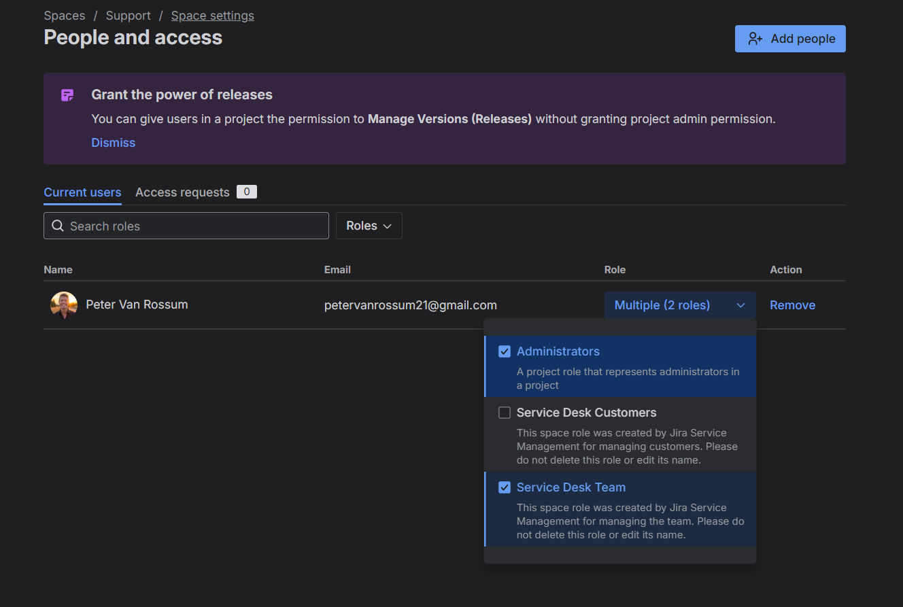
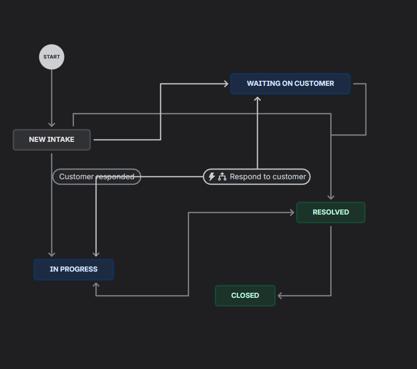
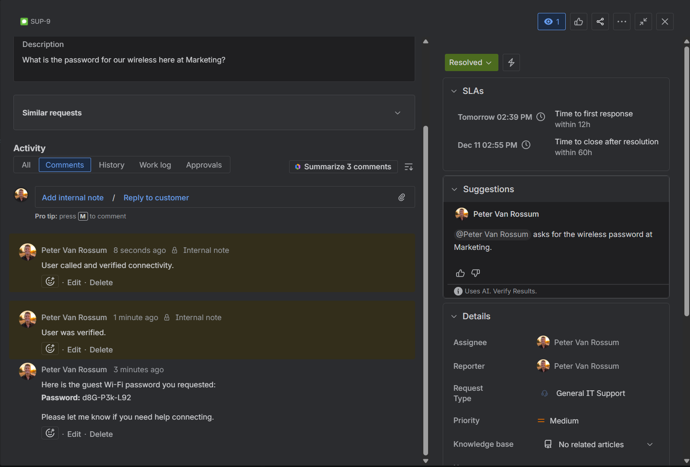
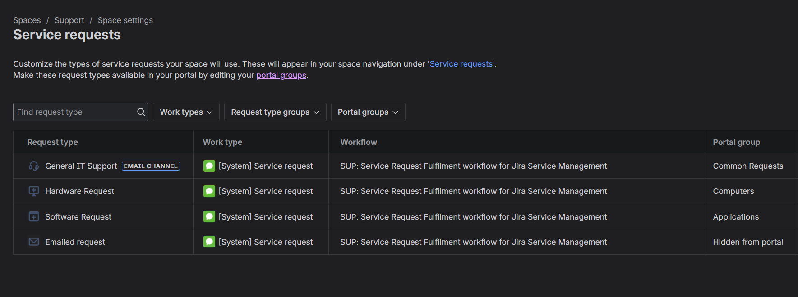
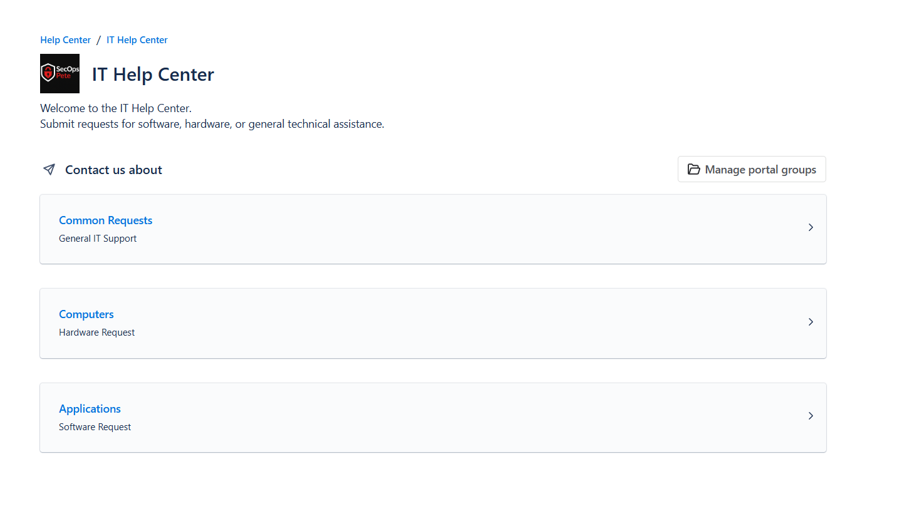
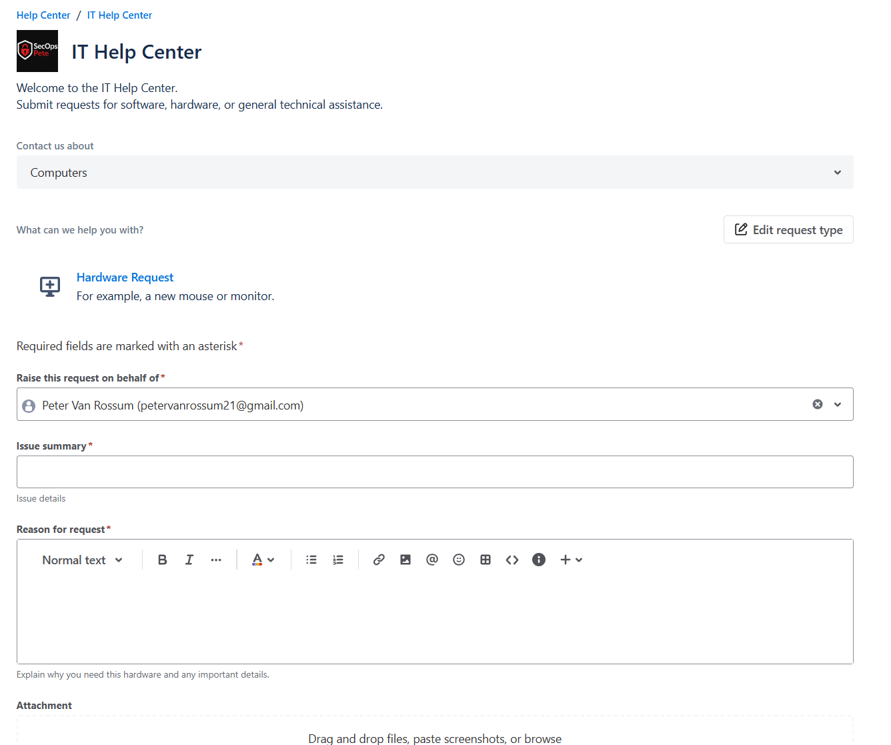
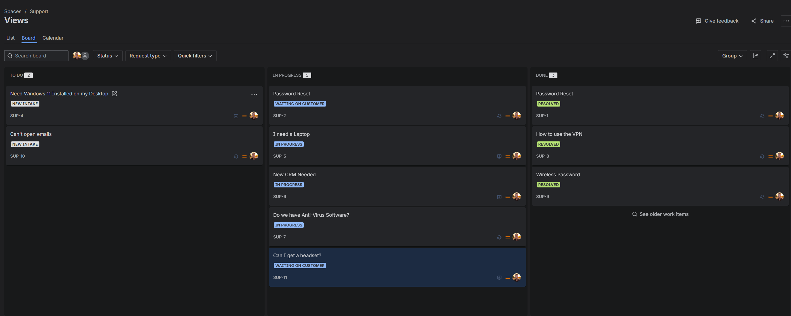
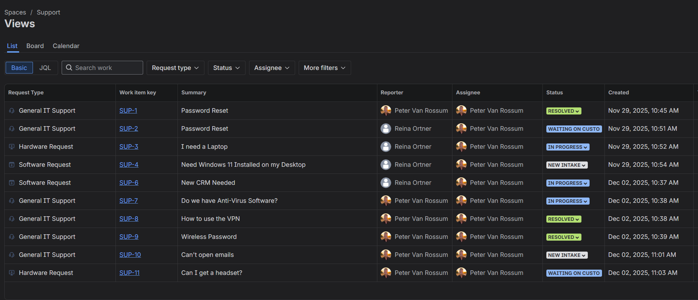
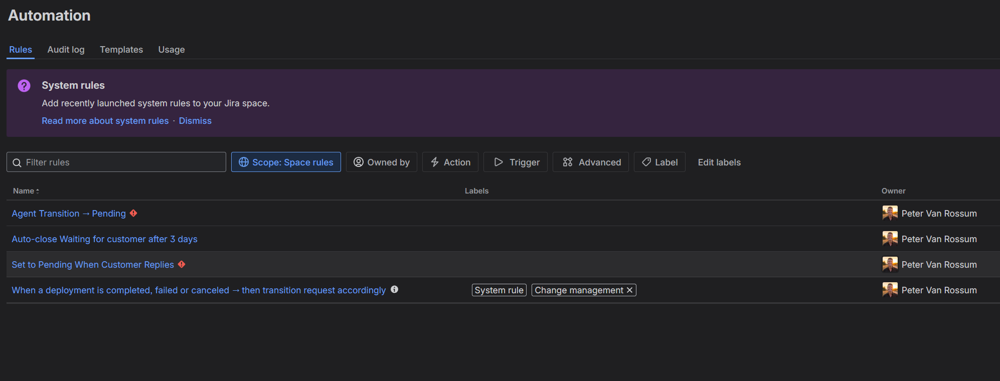

# Jira Customer Service Lab  
*A Complete Hands‑On Build of a Professional Support Environment in Jira Service Management*  
Author: **Peter Van Rossum (SecOpsPete)**  
<br>


---

## 📌 Purpose of This Project

This lab demonstrates my ability to design, configure, and document a fully operational Jira Service Desk (Jira Service Management) environment—exactly the way support teams, IT helpdesks, SaaS vendors, and customer success groups use Jira in the real world.

This lab is based on a complete 7‑step build:

1. Creating the Jira Service Desk project  
2. Cleaning and optimizing the template  
3. Designing the workflow  
4. Configuring customer‑facing request types  
5. Designing the customer portal  
6. Building internal support queues  
7. Implementing automation rules  

---

# 🧭 High‑Level Overview  
This project represents a full lifecycle support system, including:

- Intake (customer portal & request types)  
- Workflow and status design  
- SLA‑aligned queues  
- Automated status transitions  
- Auto‑closure rules  
- Intelligent routing based on agent/customer behavior  

The end result is a clean, scalable, support‑ready environment identical to the tooling used by Customer Support Engineers, ITSM teams, SaaS support desks, and internal service organizations.

---

# STEP 1 — Creating the Jira Service Desk Project  
### *Design Intent: Establish a dedicated customer‑service workspace.*

I began by creating a **Jira Service Management project** designed specifically for customer service and internal support workflows. From a hiring manager’s perspective, this demonstrates my familiarity with:

- **Team‑managed vs Company‑managed** projects  
- JSM’s intake model (request types → issues → workflow → queue)  
- How service desks differ from Jira Software projects  

Choosing Jira Service Management ensures access to:

- Queues  
- SLAs  
- Customer portal  
- Request type schemas  
- Automations designed for support teams  
<br>

### People & Access — Shows admin, service desk team, and customer role configuration:
<br>



---

# STEP 2 — Cleaning & Optimizing the Default Template  
### *Design Intent: Remove clutter and establish a clean IA (information architecture).*

Jira templates include default request types, categories, and queues. I removed anything unnecessary so the environment reflects:

- Real‑world, production‑quality organization  
- Minimal cognitive load for both agents and customers  
- A structure that reflects **only** my intended workflow  

Actions I performed:

- Deleted default request types I wasn’t using  
- Removed default queues that created noise  
- Cleaned up portal categories  
- Hid system‑generated placeholders  

This step shows I understand how **information architecture** affects customer experience and agent efficiency.

---

# STEP 3 — Designing the Workflow  
### *Design Intent: Create a workflow that supports a modern ITSM / Customer Support lifecycle.*

I modified the default workflow to reflect a realistic support pipeline:

#### ✔ NEW  
#### ✔ IN PROGRESS  
#### ✔ PENDING  
#### ✔ WAITING FOR CUSTOMER  
#### ✔ DONE  

Each status exists for a reason:

### **NEW**  
The ticket has been submitted but not triaged. Used by queues to assign or prioritize work.

### **IN PROGRESS**  
The agent is actively working on the request.

### **PENDING**  
The agent has responded and is waiting internally (e.g., for approval, internal action, or engineering).

### **WAITING FOR CUSTOMER**  
The customer owes the next reply.

### **DONE**  
Ticket resolution finalized.

The workflow reflects a fundamental principle in support operations:  
**status represents ownership** — either the support team or the customer.

### Workflow Diagram — Full lifecycle from New → In Progress → Waiting → Resolved
<br>



### Agent Issue View — Demonstrates comments, internal notes, SLA timers, and resolution flow:
<br>


<br>

---

# STEP 4 — Configuring Request Types  
### *Design Intent: Define structured customer intake that collects the right information for efficient triage.*

I configured meaningful request types including:

- **Report an Incident**  
- **Request IT Help**  
- **Software Request**  
- **Hardware Request**  

Each request type was mapped to the same underlying workflow but customized with its own fields and descriptive prompts.


### Request Types — Backend configuration of work types and portal mappings:
<br>


<br>

---

# STEP 5 — Designing the Customer Portal  
### *Design Intent: Present a clean, intuitive portal that reduces friction and improves support intake quality.*

I reorganized the customer portal with:

- Clean categories  
- Clear titles and descriptions  
- Icons that match request type meaning  
- Removal of default noise  
- Logical grouping (Incidents vs Requests)

A good portal experience reduces incorrect submissions and improves CSAT (Customer Satisfaction).

### Customer Portal Homepage — Clean, organized portal groups for intuitive intake:
<br>


<br>

### Customer Intake Form — Example of a structured and user-friendly request form
<br>


<br>

---

# STEP 6 — Building Agent Queues  
### *Design Intent: Establish a real support triage workflow.*

I created queues aligned to industry‑standard support flows:

#### **New / Unassigned**
All incoming tickets, sorted by priority.

#### **Waiting for Customer**
Tickets that require customer action.

#### **Open Service Requests**
Active work in progress.

#### **My Work**
Agent‑specific queue.

#### **High Priority Incidents (optional)**
To simulate SLA‑driven urgency.

#### Support Board — Shows live Kanban workflow for ticket triage:
<br>


<br>

Queues demonstrate my understanding of:

- SLAs  
- Ticket lifecycle management  
- Triage methodology  
- Prioritization logic  

### List View — Table-style overview used by leads/managers for tracking all tickets:
<br>


<br>

### SLA Settings — Time to First Response and Time to Resolution rules by priority:
<br>


<br>

### This dashboard presents a high-level overview of ticket volume, workflow states, and team activity:
<br>


<br>

---

# STEP 7 — Creating Automation Rules  
### *Design Intent: Automate the predictable steps in a support workflow to remove manual labor and enforce consistency.*

This section is a major part of the lab and demonstrates my ability to leverage Jira’s automation engine to replicate professional support practices.

I implemented three core rules:

---

## 🔧 Rule 1 — Auto‑Close Tickets With No Customer Response  
### **Purpose**
If a ticket is in *Waiting for Customer* and the customer does not reply for 3 days, it should automatically close.

### **Why This Matters**
- Prevents backlog clutter  
- Keeps metrics clean  
- Follows industry norms  
- Reduces manual ticket cleanup  

### **What It Does**
- Scheduled daily scan  
- Checks for “Waiting for Customer”  
- Closes tickets older than 3 days  
- Adds an auto‑closure message  

### Automation Rules — Displays lifecycle automation and SLA-enforcing rules:
<br>


<br>

---

## 🔧 Rule 2 — Set to Pending When Customer Replies  
### **Purpose**
A customer reply signals the agent needs to take action.

### **Why This Matters**
This rule supports:

- SLA accuracy  
- Ownership clarity  
- Smooth agent workflow  

### **What It Does**
If a ticket receives a comment from **anyone except the agent**, it transitions to:

```
PENDING
```

---

## 🔧 Rule 3 — Set to Waiting for Customer When Agent Replies  
### **Purpose**
When I respond to a ticket, Jira should automatically move it into the correct state, proving I understand ownership shifts.

### **Why This Matters**
This eliminates the manual task of updating ticket status and ensures a consistent support experience.

### **What It Does**
- Trigger: Comment is the main action  
- Condition: Initiator is **me**  
- Transition to:  
```
WAITING FOR CUSTOMER
```

# 📝 Final Summary

This project demonstrates my ability to:

- Architect a **complete Jira Service Management environment**  
- Configure workflows, queues, request types, and automations  
- Design a customer‑friendly portal  
- Build industry‑standard support automations  
- Document systems clearly and professionally  
- Apply ITIL‑inspired processes  
- Think like a Support Engineer and act like a Customer‑Experience professional  

---
 
